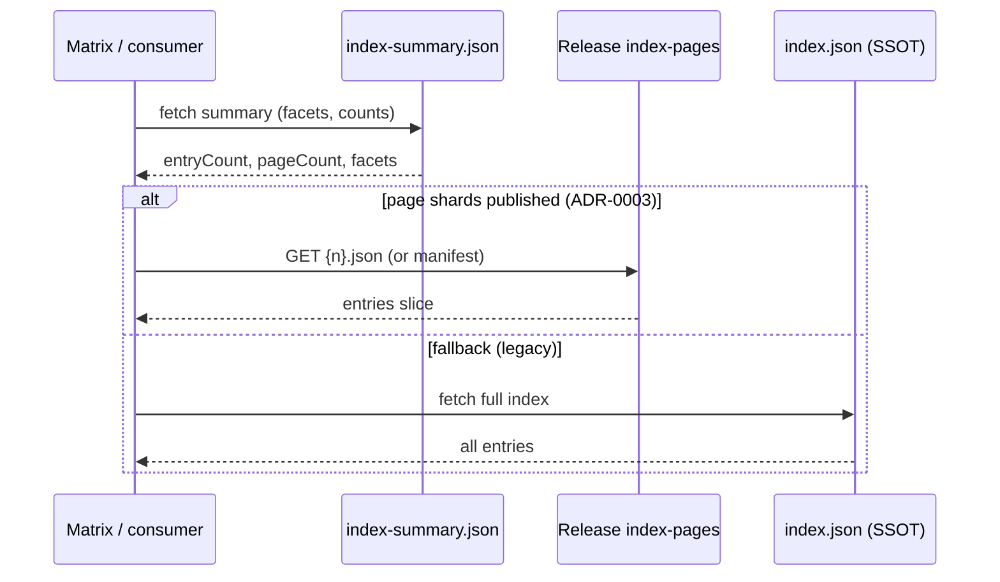
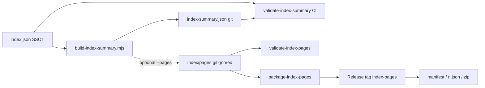

# index summary / paging データフロー

ADR-0001 / ADR-0003 / `documents/spec/index-paging.md` の補足図。

```mermaid
sequenceDiagram
  participant M as Matrix / consumer
  participant S as index-summary.json
  participant R as Release index-pages
  participant I as index.json (SSOT)

  M->>S: fetch summary (facets, counts)
  S-->>M: entryCount, pageCount, facets
  alt page shards published (ADR-0003)
    M->>R: GET {n}.json (or manifest)
    R-->>M: entries slice
  else fallback (legacy)
    M->>I: fetch full index
    I-->>M: all entries
  end
```

```mermaid
flowchart LR
  idx[index.json SSOT] --> build[build-index-summary.mjs]
  build --> sum[index-summary.json git]
  build -.->|optional --pages| pages[index/pages gitignored]
  sum --> ci[validate-index-summary CI]
  idx --> ci
  pages --> vpages[validate-index-pages]
  pages --> pkg[package-index-pages]
  pkg --> rel[Release tag index-pages]
  rel --> assets["manifest / n.json / zip"]
```
