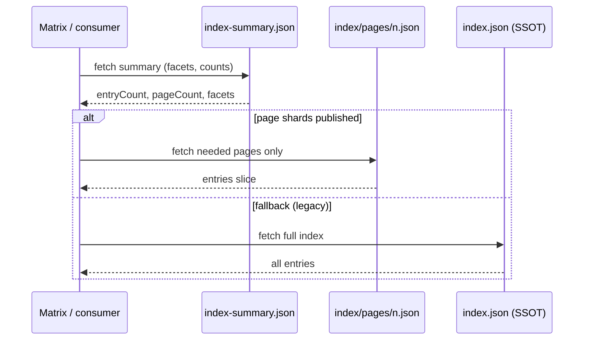
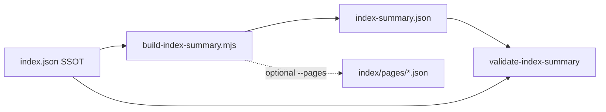

# index summary / paging データフロー

ADR-0001 / `documents/spec/index-paging.md` の補足図。

```mermaid
sequenceDiagram
  participant M as Matrix / consumer
  participant S as index-summary.json
  participant P as index/pages/n.json
  participant I as index.json (SSOT)

  M->>S: fetch summary (facets, counts)
  S-->>M: entryCount, pageCount, facets
  alt page shards published
    M->>P: fetch needed pages only
    P-->>M: entries slice
  else fallback (legacy)
    M->>I: fetch full index
    I-->>M: all entries
  end
```

```mermaid
flowchart LR
  idx[index.json SSOT] --> build[build-index-summary.mjs]
  build --> sum[index-summary.json]
  build -.->|optional --pages| pages[index/pages/*.json]
  sum --> ci[validate-index-summary]
  idx --> ci
```
